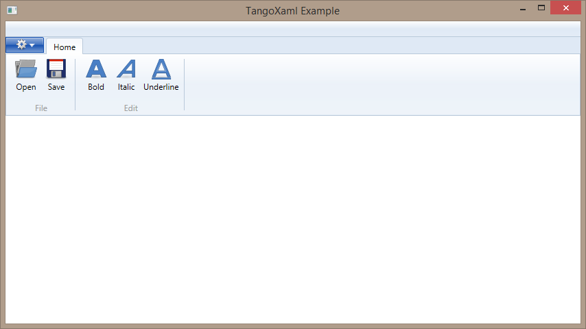
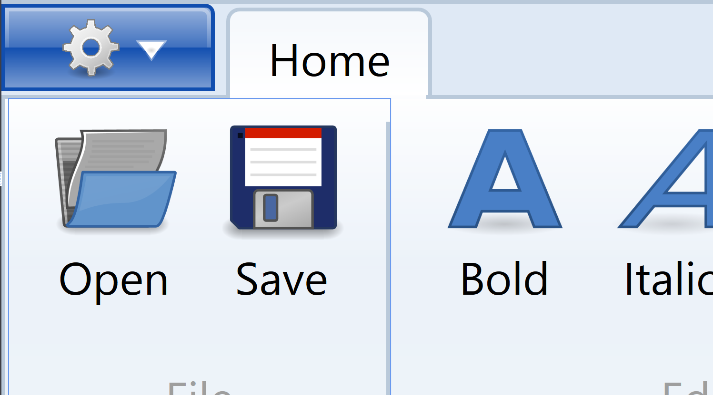

  
# TangoXaml

###_Download with NuGet: <http://www.nuget.org/packages/TangoXaml>_

---

##Summary
A WPF friendly port of the tango icon theme. Scalable SVG icons have been converted into XAML and embedded into a .Net assembly. Icons are JIT-compiled the first time they are used. The "LazyConverter" class does the JIT compile and provides conversions useful in various scenarios.

##Example

####MainSkin.xaml
```xml
<ResourceDictionary xmlns="http://schemas.microsoft.com/winfx/2006/xaml/presentation"
                    xmlns:x="http://schemas.microsoft.com/winfx/2006/xaml"
                    xmlns:tango="clr-namespace:TangoXaml;assembly=TangoXaml">
    
    <ResourceDictionary.MergedDictionaries>
        <tango:Actions />
        <tango:Devices />
        <tango:Emblems />
    </ResourceDictionary.MergedDictionaries>

    <!-- "Converter" which JIT compiles the Tango icon graphics -->
    <tango:LazyConverter x:Key="LazyConverter" />
    
    <!-- Assign icon keys for this skin -->
    <DrawingImage x:Key="SaveIcon" 
                  Drawing="{Binding 
        Source={StaticResource ResourceKey=media-floppy},
        Converter={StaticResource LazyConverter}}" />

    <DrawingImage x:Key="OpenIcon" 
                  Drawing="{Binding 
        Source={StaticResource ResourceKey=document-open},
        Converter={StaticResource LazyConverter}}" />

    <DrawingImage x:Key="FormatBoldIcon" 
                  Drawing="{Binding 
        Source={StaticResource ResourceKey=format-text-bold},
        Converter={StaticResource LazyConverter}}" />

    <DrawingImage x:Key="FormatItalicIcon" 
                  Drawing="{Binding 
        Source={StaticResource ResourceKey=format-text-italic},
        Converter={StaticResource LazyConverter}}" />

    <DrawingImage x:Key="FormatUnderlineIcon" 
                  Drawing="{Binding 
        Source={StaticResource ResourceKey=format-text-underline},
        Converter={StaticResource LazyConverter}}" />

    <DrawingImage x:Key="SettingsIcon" 
                  Drawing="{Binding 
        Source={StaticResource ResourceKey=emblem-system},
        Converter={StaticResource LazyConverter}}" />

</ResourceDictionary>
```

####MainWindow.xaml
```xml
<Window x:Class="Example.MainWindow"
        xmlns="http://schemas.microsoft.com/winfx/2006/xaml/presentation"
        xmlns:x="http://schemas.microsoft.com/winfx/2006/xaml"
        xmlns:d="http://schemas.microsoft.com/expression/blend/2008"
        xmlns:mc="http://schemas.openxmlformats.org/markup-compatibility/2006"
        xmlns:ignore="http://www.ignore.com"
        mc:Ignorable="d ignore"
        Height="480"
        Width="854"
        Title="TangoXaml Example">
    
    <Window.Resources>
        <ResourceDictionary>
            <ResourceDictionary.MergedDictionaries>
                <ResourceDictionary Source="Skin/MainSkin.xaml" />
            </ResourceDictionary.MergedDictionaries>
        </ResourceDictionary>
    </Window.Resources>

    <Grid x:Name="LayoutRoot">
        <Grid.RowDefinitions>
            <RowDefinition Height="Auto" />
            <RowDefinition Height="*" />
        </Grid.RowDefinitions>
        <Grid.ColumnDefinitions>
            <ColumnDefinition />
        </Grid.ColumnDefinitions>
        
        <Ribbon>
            <Ribbon.ApplicationMenu>
                <RibbonApplicationMenu SmallImageSource="{StaticResource SettingsIcon}">
                </RibbonApplicationMenu>
            </Ribbon.ApplicationMenu>
            
            <RibbonTab Header="Home" IsSelected="True">
                <RibbonGroup Header="File">
                    <RibbonButton Label="Open" LargeImageSource="{StaticResource OpenIcon}" />
                    <RibbonButton Label="Save" LargeImageSource="{StaticResource SaveIcon}" />
                </RibbonGroup>
                <RibbonGroup Header="Edit">
                    <RibbonButton Label="Bold" LargeImageSource="{StaticResource FormatBoldIcon}" />
                    <RibbonButton Label="Italic" LargeImageSource="{StaticResource FormatItalicIcon}" />
                    <RibbonButton Label="Underline" LargeImageSource="{StaticResource FormatUnderlineIcon}" />
                </RibbonGroup>
            </RibbonTab>

        </Ribbon>
    </Grid>
</Window>
```

####Result
  

  
####Icons stay smooth (non-pixelated) even with 800% zoom
  
  
---

## Changes
#### 1.0.2 (Next Release)
* Optimization: XAML files are pre-compiled into BAML instead of being JIT-compiled at runtime
* __TODO:__ Must rewrite loading logic to use the [embedded BAML resources](http://github.com/TheFirstDeity/TangoXaml/wiki/Embedded-BAML-Resources)

#### 1.0.1
* Correction to LazyConverter type checking

## Credits
**Fork Author:** [TheFirstDeity](https://github.com/TheFirstDeity)  
**Fork Copyright 2014:** Monadone (<me@monadone.com>)  
**Project Page:** <https://github.com/TheFirstDeity/TangoXaml>  
**Forked From:** <https://github.com/stephenc/tango-icon-theme>  

---

* Special thanks to the [authors][tango-authors] of the [Tango Icon Theme](http://tango.freedesktop.org/), who released the icons into the [public domain][tango-copying].
* Thanks to the authors of [SharpVectors](http://sharpvectors.codeplex.com/), which was used to convert the SVG files into XAML.

## Liscense
The [software][] portion of this repository is liscensed under the MS-PL. The [liscense][] 
is located in the [software][]'s folder.

[software]: https://github.com/TheFirstDeity/TangoXaml/tree/master/TangoXaml
[liscense]: https://github.com/TheFirstDeity/TangoXaml/blob/master/TangoXaml/Liscense.txt
[tango-authors]: https://github.com/TheFirstDeity/TangoXaml/blob/master/Tango/AUTHORS
[tango-copying]: https://github.com/TheFirstDeity/TangoXaml/blob/master/Tango/COPYING